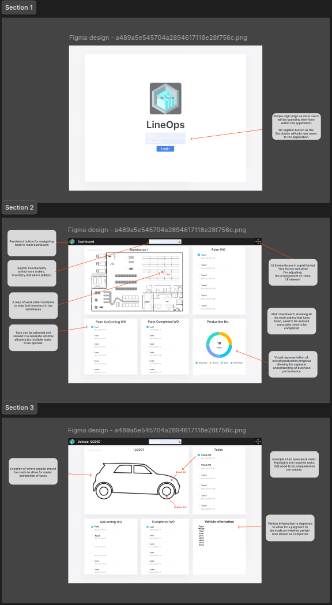
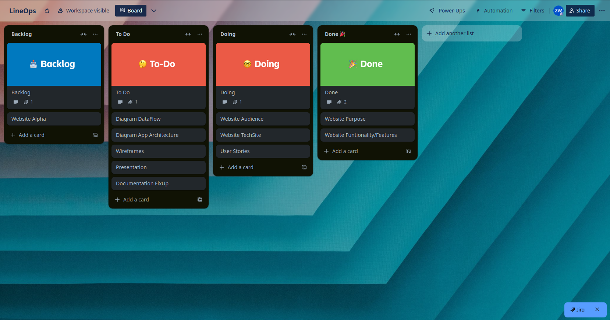
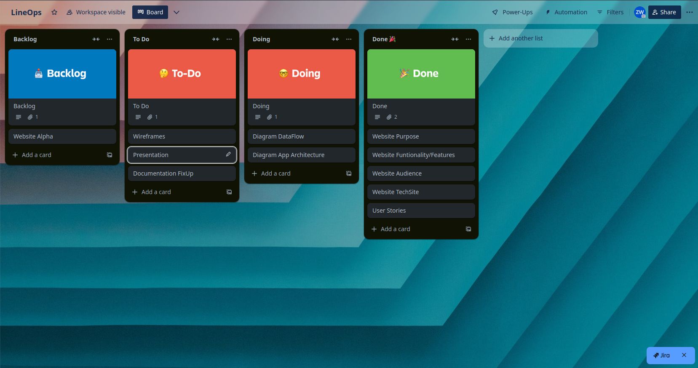
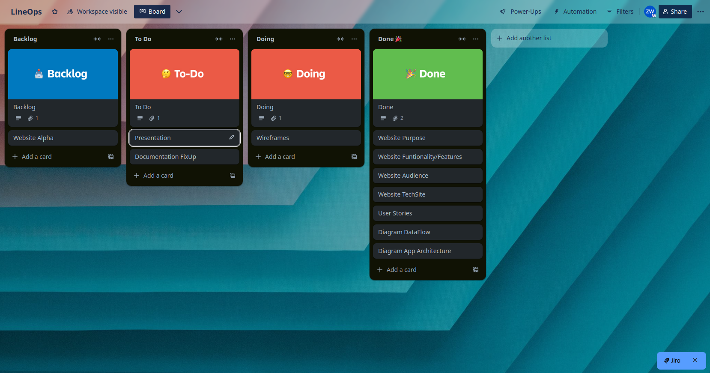
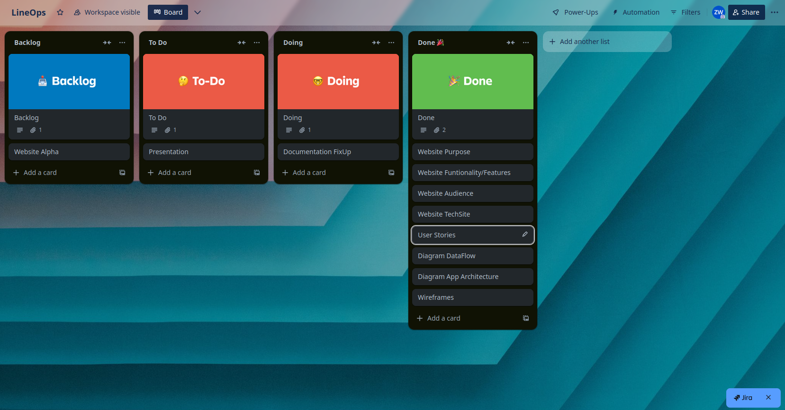
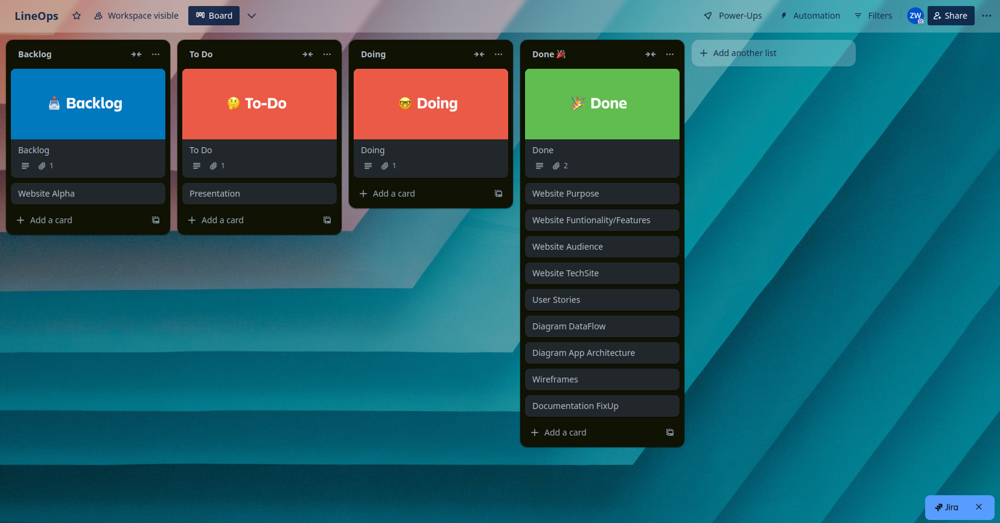
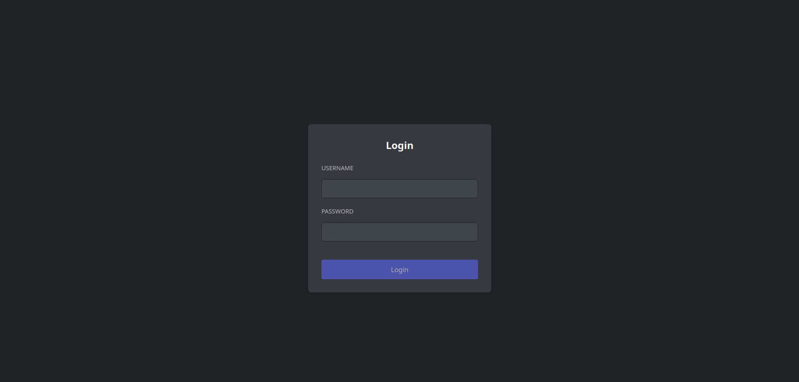
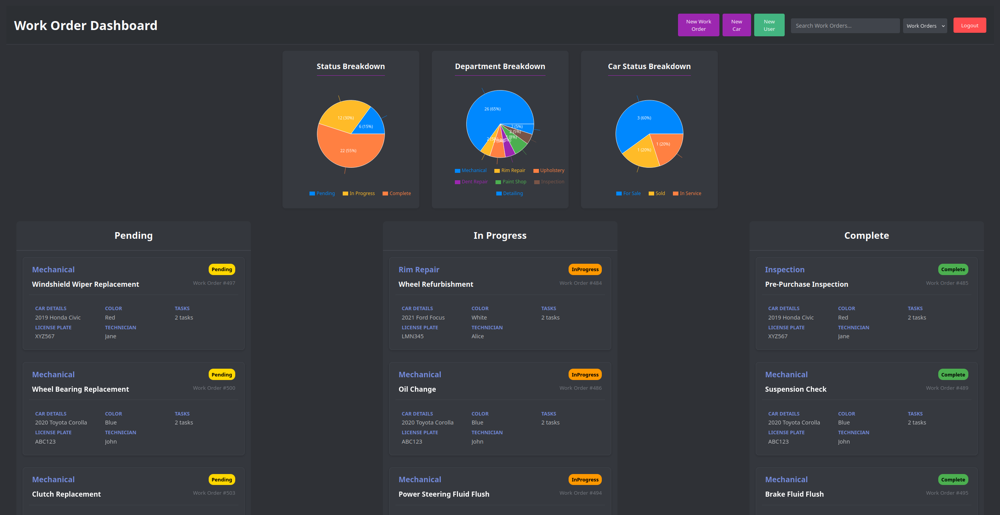

T3A2-B LineOps Zenki Whiteley

LineOps

Work Order Management Tool

**Links**

[Site](https://lineopstest.netlify.app/login)
<br>
(*Note, may take time to spin up backend, please refresh if you have issues)*<br>
(*or check backend health)* <br>
[Backend Health](https://feb24-t4w2-express-auth-1.onrender.com/api/health)

<br>
(*Admin User: Username: admin / Password: password123)* <br>
(*Normal User: Username: janesmith / Password: password123)* 

[Fontend](https://github.com/R-Z-W/LineOps)

[Backend](https://github.com/R-Z-W/LineOpsBackend)
<br>
(*Note, commits have been cleaned)*

**Purpose**  
LineOps is a streamlined work order management platform that captures the core functionalities of Microsoft Dynamics 365 Field Services but removes the unnecessary fluff. It aims to simplify production lines and warehouse operations through an intuitive and user-friendly interface.

The inspiration for LineOps came from the frustrations of using Field Services, where completing even basic tasks required navigating multiple menus and pop-ups, which could all go to waste with the odd crash. In addition to usability challenges, the software's cost is a major drawback. At $157.10 per user per month, a company with 50 employees would spend $95,000 annually on a solution, that is highly inefficient.


## Setup & Installation
### Frontend
```bash
# Clone repository
git clone <repository-url>

# Install dependencies
npm install

# Create .env file
VITE_BACKEND_URL=https://your-backend-url.com

# Start development server
npm run dev

# Build for production
npm run build
```


### Backend
```bash
# Clone repository
git clone <repository-url>

# Install dependencies
npm install

# Create .env file
DATABASE_URL=your_mongodb_connection_string
JWT_SECRET=your_jwt_secret
PORT=8080
FRONT_URL=your_frontend_url

# Seed database
node src/seed.js

# Start backend server
npm start

# Run test
npm test

```


**Features**

LineOps seeks to remedy this by providing a more concise package that has been tailor made to fit my current employers situation.

LineOps provides:

- **Work Orders**  
    The work order feature provides a structured system for tracking and delegating tasks. Each work order includes detailed task definitions, specific locations, required roles, departments, and required inventory. Users can monitor progress in real-time, schedule and assign tasks efficiently, and track historical data.
- **User Dashboards**  
    The role-specific interfaces help provide relevant information and tools for each user. Additionally, UI will have adjustable options allow users to personalise their dashboard to fit their preferences or operational needs.

**Extra Features**  
In addition to core functionalities, LineOps will aim to provide additional features such as:

- **Work Order Enhancements**
  - Ready-to-use templates for common tasks.
  - Automated notifications and alerts for task updates.
  - Integrated training guides to assist new users.
  - Material requirement planning and inventory allocation.
  - Location mapping.
  - Comments section for communication.
- **Analytics**
  - Visual graphs to track key performance.
- **Inventory Management**
  - Real-time stock tracking.

**Target Audience**  
The target audience of LineOps includes medium-sized to larger businesses, like my current employer, that seek to expand their operations by replacing their current off-the-shelf software solutions with a more tailored made solution for their production line and warehouse operations. It aims to increase their production efficiency and reduce operation costs.

**Tech Stack**

LineOps aims to be developed using a MERN stack. This will consist of:

Front-End:

- HTML5
- CSS
- JavaScript
- Hosted: Netlify

Back-End:

- NodeJS
- ExpressJS
- Hosted: Render

Database:

- MongoDB
- Mongoose
- Hosted: Atlas

Testing

- Jest
- SuperTest

Project Management

- Trello

Development

- GitHub,
- Visual Studio Code

UI Design:

- Figma

Additional Design Tools:

- Draw.io
- LucidChart
- PlantUML

**Dataflow**
**Application Architecture**

%20example(3)(1).png)

**R4 User Stories**

For User Stories, I have created multiple personas of positions at my current employer:

<table><tbody><tr><th><p>Name</p></th><th><p>Position</p></th><th><p>Background</p></th><th><p>Needs</p></th></tr><tr><td><p>Joe</p></td><td><p>Mechanic</p></td><td><p>Experienced in vehicle repair and maintenance. Skilled in diagnosing mechanical issues and replacing parts.</p></td><td><ul><li>A user-friendly interface for quick updates and access to work order details.</li><li>List of required parts to be collected from part storage.</li><li>Real-time notifications about work order status changes.</li><li>Ability to log repairs and maintenance notes.</li></ul></td></tr><tr><td><p>Garcia</p></td><td><p>Detailer</p></td><td><p>Automotive detailer who specializes in interior and exterior vehicle detailing with a keen eye for cleanliness and aesthetics.</p></td><td><ul><li>Clear task lists and deadlines.</li><li>Ability to mark tasks as completed and log notes.</li><li>Uses gloves all day, therefore needs easy to press buttons on UI.</li><li>Be able to track work progress of tasks over periods of time such as fabric drying.</li></ul></td></tr><tr><td><p>Reed</p></td><td><p>Painter</p></td><td><p>Automotive painter experienced in colour matching, advanced painting techniques, and paint reconditioning. Has a strong understanding of automotive finishes and standards.</p></td><td><ul><li>Access to detailed work order instructions and timelines.</li><li>Understanding of which cars have high priority.</li><li>Wears a mask and eye protection, therefore needing an easy to view UI.</li><li>Notifications about changes to priority or deadlines.</li></ul></td></tr><tr><td><p>Chen</p></td><td><p>PDR</p></td><td><p>Repairs dents with various tools and techniques, including paintless dent repair.</p></td><td><ul><li>Simple process to log dent repair progress and related notes.</li><li>Clear visibility of assigned tasks and priority order.</li><li>Real-time updates for communication and coordination.</li><li>Distinctive outline of which dents to repair, and which to leave.</li></ul></td></tr><tr><td><p>Brook</p></td><td><p>Manager</p></td><td><p>Oversees scheduling, resource allocation, and ensures work orders are completed on time.</p></td><td><ul><li>A comprehensive dashboard that shows real-time updates and current work order statuses.</li><li>Tools for task prioritisation and team communication.</li><li>Visual graphs to easily monitor progress of work order completion.</li></ul></td></tr><tr><td><p>Tom</p></td><td><p>Sys Admin</p></td><td><p>Experienced in managing IT systems. Responsible for ensuring the smooth functioning of the web application, data security, and user management.</p></td><td><ul><li>Access to an administrative dashboard for monitoring and maintenance.</li><li>Tools for managing user roles and permissions.</li><li>Alerts for system errors or security breaches.</li></ul></td></tr></tbody></table>

Final Revision Of User Stories:

**Joe (Mechanic)**

1. As Joe, I want a user-friendly interface for quick updates and work order access so that I can stay organised and complete tasks efficiently.
2. As Joe, I want a list of required parts to be collected from part storage so that I can save time and avoid delays in repairs.
3. As a Joe, I want to access clear task instructions, so that I can complete repairs accurately and meet quality standards.
4. As Joe, I want real-time notifications about work order status changes so that I can prioritise my tasks effectively.
5. As Joe, I want the ability to log repairs and maintenance notes so that I can keep accurate records for future reference.

**Garcia (Detailer)**

1. As Garcia, I want clear task lists and deadlines so that I can prioritise my detailing work efficiently.
2. As Garcia, I want the ability to mark tasks as completed and log notes so that I can track my progress and communicate updates.
3. As Garcia, I want an easy-to-press button interface so that I can operate the system comfortably while wearing gloves.
4. As Garcia, I want to track task progress over time, such as interior drying or ozone treatment, so that I can manage my workflow better.

**Reed (Painter)**

1. As Reed, I want access to detailed work order instructions and timelines so that I can plan my painting tasks accurately.
2. As Reed, I want clear visibility of high-priority cars so that I can focus on the most urgent tasks.
3. As Reed, I want an easy-to-view user interface so that I can operate the system comfortably while wearing a mask and eye protection.
4. As Reed, I want to monitor paint drying, so that I can maximise my time allocation for each car.
5. As Reed, I want notifications about changes to priorities or deadlines so that I can adjust my schedule accordingly.

**Chen (PDR)**

1. As Chen, I want a simple process to log dent repair progress and notes so that I can maintain accurate records efficiently.
2. As Chen, I want clear visibility of my assigned tasks and their priority order so that I can manage my workload effectively.
3. As Chen, I want real-time updates for communication and coordination so that I can collaborate seamlessly with my team.
4. As Chen, I want to add notes to work orders, so that my supervisors and team members are informed of any irreparable damage.
5. As Chen, I want a distinctive outline of which dents to repair and which to leave so that I can deliver precise results.

**Brook (Manager)**

1. As Brook, I want a comprehensive dashboard with real-time updates and current work order statuses so that I can monitor overall progress effectively.
2. As Brook, I want tools for task prioritisation and team communication so that I can allocate resources efficiently.
3. As Brook, I want visual graphs to monitor the progress of work order completion so that I can identify bottlenecks and resolve them quickly.

**Tom (Sys Admin)**

1. As Tom, I want access to an administrative dashboard for monitoring and maintenance so that I can ensure the application runs smoothly.
2. As Tom, I want tools for managing user roles and permissions so that I can control access and maintain security.
3. As Tom, I want real-time alerts for system errors or security breaches so that I can respond to issues promptly.

**Wire frames**



**Project Management**







**Final Result**





